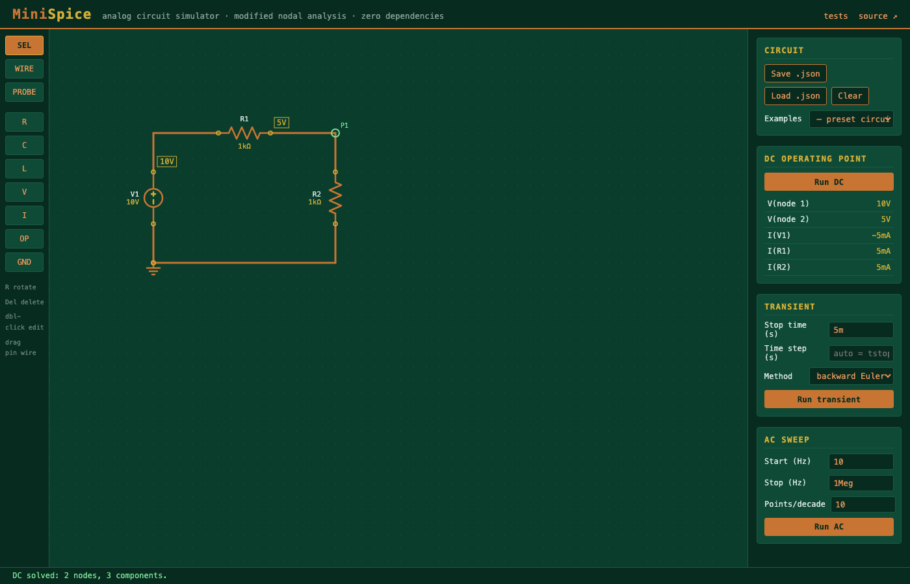
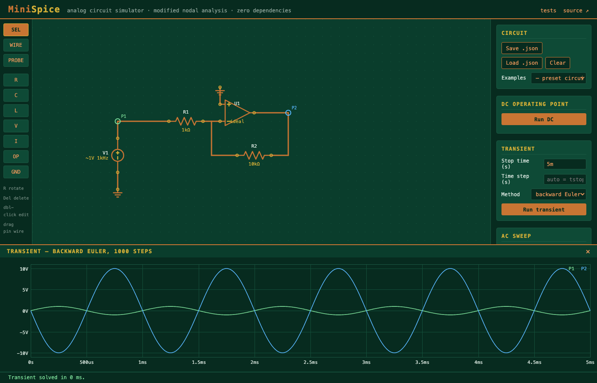
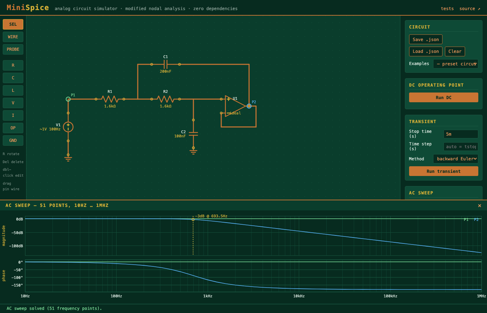

# MiniSpice

A browser-based analog circuit simulator built **from scratch** — a mini
LTspice/Falstad. Draw a circuit on a canvas, then run DC operating point,
transient, and AC (Bode) analyses. The numerical core is hand-written
**Modified Nodal Analysis** with an LU solver; there are **zero runtime
dependencies** — vanilla HTML/CSS/JS, deployable to GitHub Pages as-is.

> 🎯 This repo doubles as a learning artifact: the engine is commented like
> a tutorial, every analysis explains its own math, and `tests/` verifies
> the simulator against hand-calculated analytical answers.



| Transient — inverting op-amp (gain −10) | AC sweep — Sallen-Key lowpass Bode plot |
|---|---|
|  |  |

## Try it

**Live:** https://davidwang1231.github.io/minispice/

**Locally:** ES modules don't load from `file://`, so serve the repo over
HTTP and open http://localhost:8000:

```sh
git clone https://github.com/DavidWang1231/minispice.git
cd minispice
python3 -m http.server 8000
```

## Features

- **Schematic editor** — grid-snapped canvas: R, C, L, V/I sources, ideal
  op-amp, ground. Click a toolbar part to place; drag from any pin to draw
  L-shaped wires; `R` rotates, `Delete` deletes, double-click edits values
  (engineering notation accepted: `4.7k`, `100n`, `2Meg`).
- **DC operating point** — node voltages annotated directly on the
  schematic, branch currents in the side panel.
- **Transient analysis** — backward Euler or trapezoidal integration,
  companion models for C/L, sources: DC / sine / step / pulse. Voltage
  probes pick what gets plotted.
- **AC sweep** — complex-valued MNA solved per frequency point; Bode plot
  (magnitude dB + phase °) with log axis, decade gridlines, and automatic
  −3 dB marker.
- **Save/load** — circuits are plain JSON (download/upload); five presets
  in `examples/`. Shareable URLs: `?load=rc-lowpass&run=ac`.
- **Tests** — open `tests/test_runner.html`: 7 required circuits with
  analytical answers derived in the comments (16 assertions).

## How it works (the 60-second version)

1. **Netlist extraction** (`js/editor/netlist.js`) — union-find over pin
   coordinates and wire segments turns geometry into "R1 connects node 2
   to node 0". Ground symbols force node 0.
2. **MNA assembly** (`js/engine/mna.js`) — every element "stamps" a small
   fixed pattern into the `(N+M)×(N+M)` matrix: KCL rows for the N
   non-ground nodes plus one constraint row per voltage-source-like branch
   (independent V sources and op-amp outputs). The ideal op-amp is a
   *nullor*: one equation (`V+ = V−`) and one unknown (output current).
3. **Solve** (`js/engine/solver.js`) — LU decomposition with partial
   pivoting, written generic over a scalar "field" so the *same code*
   solves real systems (DC, transient) and complex ones (AC).
4. **Analyses** —
   - *DC*: capacitors open, inductors short (0 V source).
   - *Transient* (`transient.js`): discretize time; each C/L becomes a
     conductance + current source ("companion model") whose values come
     from the previous step, so every step is a DC solve. Fixed step; the
     matrix is factored once and reused.
   - *AC* (`ac.js`): phasors — `d/dt ≡ ×jω`, so C→`jωC`, L→`1/jωL`, and
     the whole thing is MNA over complex numbers.

No DOM access inside `js/engine/` — the engine is a pure function of the
netlist, which is what makes the analytical tests possible.

## Repo map

```
index.html            app shell
css/style.css         PCB theme (soldermask green / copper / ENIG gold)
js/main.js            bootstrap; the only file that sees editor AND engine
js/editor/            canvas schematic editor (geometry world)
  components.js         part catalogue, symbols, value parsing
  schematic.js          interactions + rendering
  netlist.js            geometry → netlist (union-find)
js/engine/            numerical core (topology world, DOM-free)
  mna.js                matrix stamps
  solver.js             LU decomposition, partial pivoting
  dc.js  transient.js  ac.js
js/plot/              canvas plots: waveform.js, bode.js
js/util/complex.js    complex arithmetic + the real/complex field objects
tests/                framework-free browser test page
examples/             preset circuits (JSON)
NOTES_FOR_DAVID.md    implementer → owner handoff notes
```

## Out of scope (v1)

Nonlinear devices (diodes/transistors need Newton–Raphson), adaptive time
stepping, subcircuits, mobile touch support.

## License

MIT
